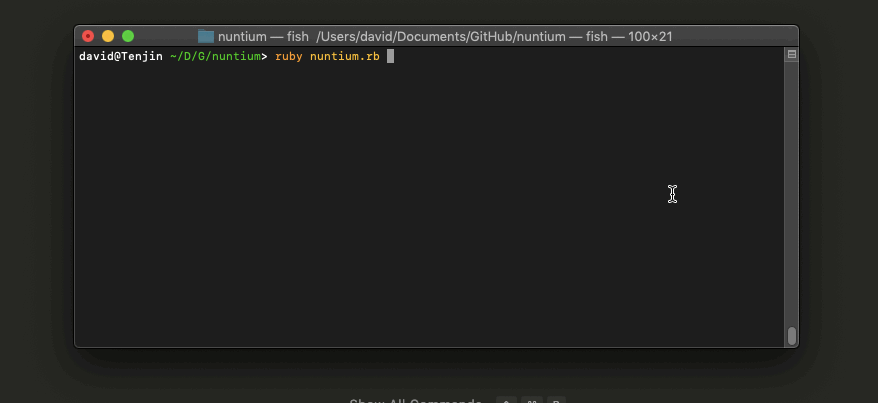

# nuntium
Nuntium (Latin for `news`!) is a news/stock/etc. feed reader for CLI and (eventually) other displays.

I'll add some more info here as development continues, but in the meantime here's a *sick* gif:

RSSHub update - This project's RSS feed aggregator (arguably the "core" part of this entire application) now supports its own fork of RSSHub. The documentation and READMEs are within the RSSHub directory, and it should be assumed that any routes available to it are only available within Nuntium. I'll maintain that fork and add feeds if a feed that I personally want doesn't exist or doesn't work "out of box" with Nuntium.

The internal RSSHub is easy to use - I need to add more docs, but you just need to `cd` into RSSHub, run `npm install` before using it in your config. From there, `config.json` in root can be updated to point to RSSHub feeds. Another note is  that all `localhost`/RSSHub feeds need to be hit with `http`. Another note is that this instance uses port `1200`. If Nuntium picks up a RSSHub feed in `config.json` it will attempt to start up the RSSHub instance.